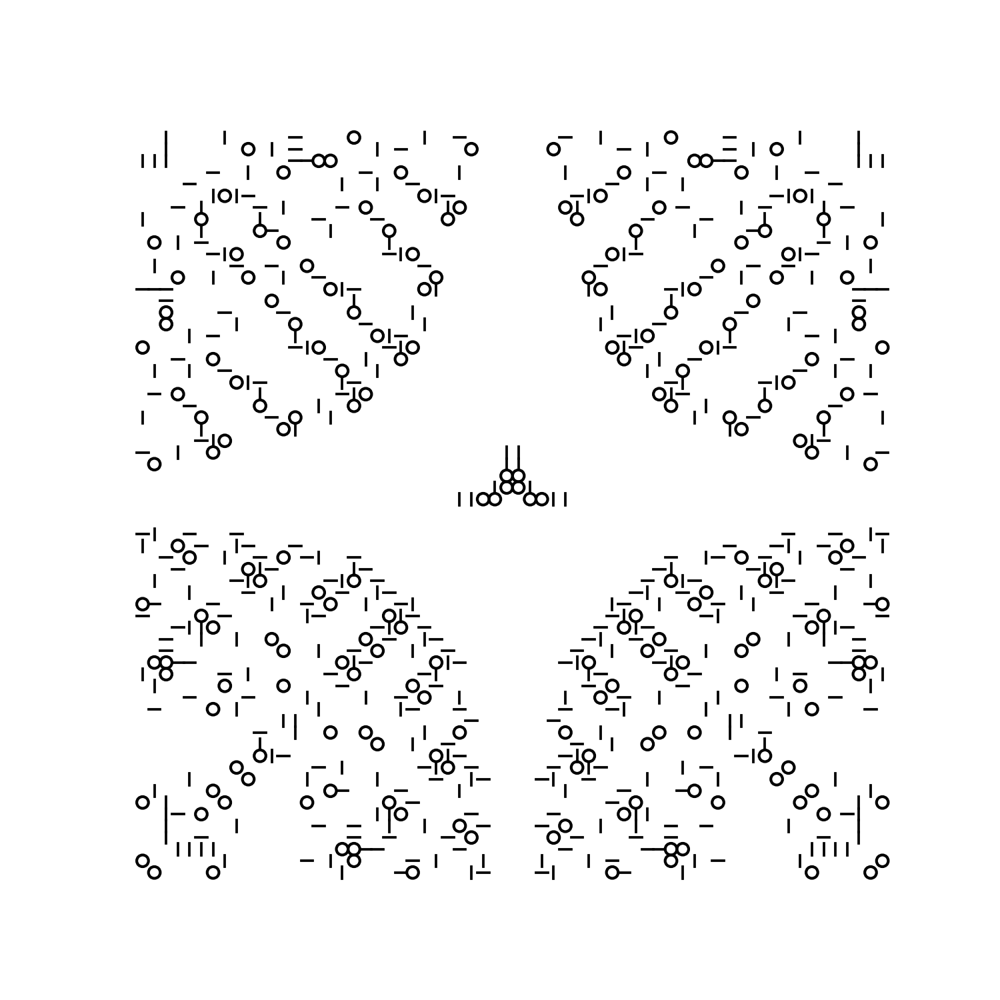

# Autoglyphs

"Autoglyphs are an experiment in generative art, each one unique and created by code running on the Ethereum blockchain."
 > https://www.larvalabs.com/autoglyphs

This repo contains the generation code for autoglyphs in Python. I believe the seeds are unknown so exact autoglyphs are not possible to generate, but you can make your own unique autoglyph.
Some of my favorite examples are below.

## Examples

### Autoglyph #2974649095

### Autoglyph #950298847

### Autoglyph #3499369648

